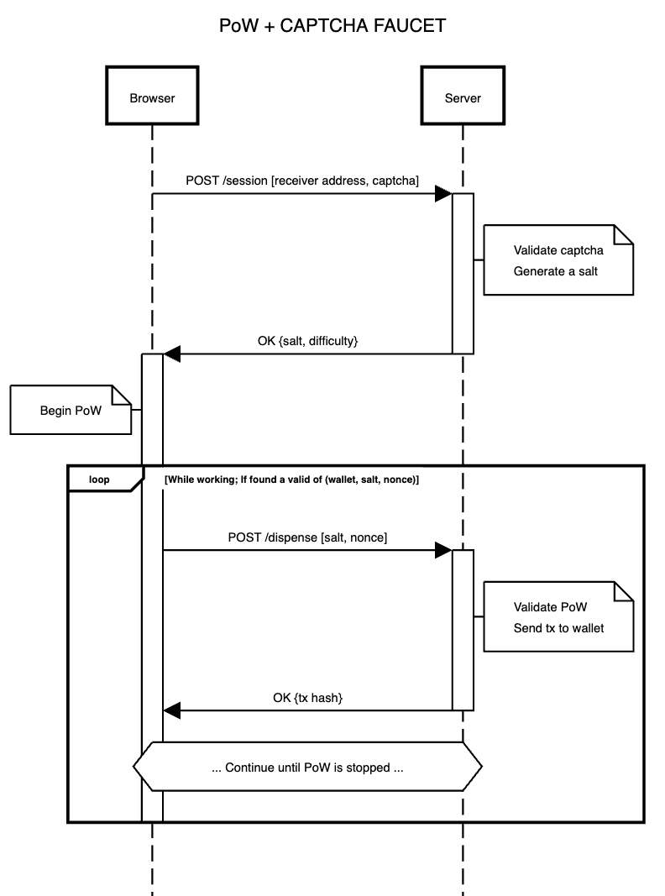

# Proof of work

The faucet dispenses funds with a CAPTCHA and SHA256 PoW (Proof of work) mechanism. The following diagram demonstrates the flow of messages exchanged between the served webpage and the server backend.

A high level explanation of the inner workings is offered now:

- The backend offers two static files, one being an HTML document at the root directory, and a javascript script at `/worker`. Both can be found at [the static directory of the repository](/static/).
  - The HTML document a single page application with a form that executes with the communication flow at the diagram.
  - The javascript script contains a webworker that will be imported in the HTML document to execute the long running PoW task. This is necessary to avoid UI blocking. This worker will communicate with the main HTML document to report back valid nonces that can be used to obtain funds from the faucet
- The system works via salt based sessions. The client will request the server to generate a valid salt for the wallet address specified at the form through the `POST /session` endpoint. The request is accompanied by a captcha validation. The salt will be associated with the wallet address in an in-memory database (a simple hashmap). Then, the server will send a response to the client indicating the difficulty level that must be satisfied by the proofs, along with the salt. The salt is generated and kept by the server with the sole objective of avoiding replay attacks, and all salts are wiped out upon reset.
- The difficulty level is an u8 integer that signals how many leading zeroes bits a valid SHA256 hash must contain. The hash must be obtained by the concatenation of the `salt` and a `nonce` in a string. E.g. if the difficulty level is 6, it means that the hash must be of the form `000000[101010]..` (note this is binary, not hex). Difficulty is thus doubled with each level.
- Once the client has obtained its salt, it can begin iterating with a nonce. Everytime a valid nonce is found, the client sends the salt to the `POST /dispense` endpoint, which will retrieve the address associated with the salt, and check the SHA256 hash of the `salt` and `nonce` concatenation. If the proof of work is correct, it will craft a transaction to send the funds, and return an OK response containing the `txId` of the forwarded funds.

# Improvement proposals

- Change the SHA256 PoW for a CPU focused PoW algo (e.g. scrypt)
- Daily cap
- Group together valid nonces under a single transaction
